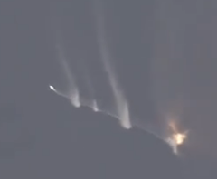

# 关于星舰首飞这档事（星舰首飞复盘）

**Musk:** 

1、我很高兴地报告说，发射台的损坏实际上非常小，并且应该会很快得到修复。

> 看来真打算填填凑活用了，希望装了水冷钢板会有好转吧。
>
> 

2、从我们观察到的，火箭在翻滚时仍保持完整来看，火箭的结构强度似乎比我们预期的要好。

> 尾焰都飙成这样了
>
> 

3、从发射台的角度来看，我们可能在6到8周内就准备好进行下一次发射了。

> 这个是纯吹牛

4、最耗时的工作可能是重新验证飞行终止系统...它花费的时间太长了，需要将油箱爆破的时间缩短。

> 就是自毁系统（FTS），⬇ship24，booster7⬇。想起来一个meme建议反向贴爆反
>
> 

5、飞行终止系统的启动时间“相当长”，大约“40秒左右”。

> 图中已经启动了，但是只是炸了个小口，推进剂都在往外露。最后因为空气动力才爆炸
>
> 

6、我们选择不启动了3个发动机，所以超级重型助推器带着30个发动机升空，这是最少的发动机数量。

7、这3个发动机“没有爆炸”，但只是“不能健康地将它们带到全推力，所以它们被关闭了。”

> 有没点着的，就斜着飞了
>
> 

8、在T + 27秒时，SpaceX失去了通信，因为发生了“某种能量事件”。而且“某种爆炸导致17、18、19或20号引擎的热屏障受损。

> 狂闪，真以为多看一眼就会爆炸，在booster7底端的液压系统大概开始坏了
>
> 

9、火箭在通过T + 62秒时继续飞行，发动机仍然运转。在T + 85秒时失去了推力矢量控制。

> 大概液压油漏完了，开摆（估计还用推力差控制挺了一会儿）
>
> 

10、在升空期间，在超级重型助推器下方产生了“岩石龙卷风”，但SpaceX并未“看到证据表明这个岩石龙卷风实际上对发动机或热屏障造成了实质性的损害。可能发生了，但是我们没有看到这样的证据。

> 

11、实际上让这个火箭起飞很好，我们在超级重型助推器9及以后做出了很多改进。

12、“真正需要做的就是让这个火箭飞起来，然后继续改进助推器。”

> 建造中的ship&booster：
>
> 

13、AFTS(启动飞行终止系统)之后，“飞船没有尝试自我拯救”。

> 
>
> 没有尝试分离可惜了，本来还可能继续表演

14、下一次Starship的重要事情是确保我们不会失去Booster 9的推力矢量控制。

> 从液压换成了电动推力矢量控制
>
> 

15、在下一次Starship飞行之前，我们将在发射塔下面放置很多钢材。“碎片实际上只是沙子和岩石，所以它并不具有毒性...本质上就像沙尘暴...但我们不想再遇到这种情况了。”

> 水冷钢板，不知道有没有中间的圆锥
>
> 

16、今年用Starship到达轨道的概率可能达到80%，在12个月内接近100%。

17、关于为什么会喷出一个大坑的推测，其中一个更有可能的解释是...尾焰可能将混凝土下面的沙子压缩到了这样的程度，使得混凝土弯曲并裂开。

> 裂开后就都被吹飞了
>
> 

18、之所以选择钢板而不是导流槽，是因为对于火箭中的载荷来说，更糟糕的声学环境对载荷并不重要，因为它距离火箭大约400英尺（120米）远。

> 还是想省钱吧，发射场场靠海，都是湿地，一挖就渗水。

19、这次飞行“非常接近我预期的情况”。

> 没炸台就是成功了属于是

20、离阶段分离相当接近...如果我们保持了推力矢量控制并加速推力，那么我们就可以成功达到阶段分离。

21、下一次飞行的目标是实现阶段分离并希望取得成功。

22、我对下一次飞行的期望是到达轨道。下一次的飞行配置将与首飞一样。

> 应该会有隔热瓦与襟翼，计划测试再入
>
> 

23、这些任务的目标仅仅是获取信息。比如说，我们没有任何载荷或其他物品——仅仅是尽可能多地学习。

24、肯定不会预计月球Starship（在HLS项目下）是Artemis III任务中最耗时的部分。

25、“我们将是第一个做好登月准备的。”

> 有点吹牛了，sls猎户座都成功首飞了。主要是你这个太大了
>
> 

26、今年用Starship到达轨道的概率可能达到80%，在12个月内接近100%。

27、减缓了Raptor发动机的生产，“因为我们有比我们能处理的更多的Raptor发动机。”

28、预计今年将在Starship上花费大约20亿美元。

29、我们不预计需要筹集资金...我们认为我们不需要筹集资金。我们将惯例为员工提供流动性。

> “将按惯例为员工提供流动性”，指的是一种常见做法，即在公司进行首次公开募股或被收购之前，向员工提供股权或期权出售的机会（即将其股份转换为现金）。这使得员工能够实现他们在公司所拥有的股权价值，为他们提供了额外的财务灵活性，并可能降低他们的风险暴露。

30、但据我所知，我们不需要为SpaceX额外筹集资金。

31、对于下一次飞行，“我们将加快启动发动机和脱离发射台的速度。”从发动机启动到移动火箭的时间约为5秒，这是在不断喷射高压气体对着发射台的时间很长。我们将尝试将这个时间缩短一半。

> 看的时候点火半天飞不起来真哈人
>
> 

32、Starship没有达到SpaceX认为的“安全点”进行阶段分离。

> 分离机构应该没有损坏，只是没有执行分离程序

33、我认为SpaceX团队做得非常出色。

34、这肯定是人类所面临的最难的技术问题之一。

35、在环境反应方面，Musk表示：“火箭使用无毒推进剂...散布了很多粉尘，但据我们所知，环境并没有遭受任何重大损害。”

> 迫真粉尘，宇宙很大地球只是一粒沙了属于是（
>
> 

36、SpaceX还没有最终决定哪个Starship原型和超级重型助推器将进行下一次发射。

37、将更换储罐场中的一堆油箱，但这些油箱我们本来就想更换。

> 老惨力
>
> 

38、塔本身处于良好状态。即使遭受了一些相当大的混凝土碎片的撞击，我们也没有看到塔上有任何实质性损伤。

> 老惨力，幸亏还能动
>
> 

**最后再一睹芳容吧**

