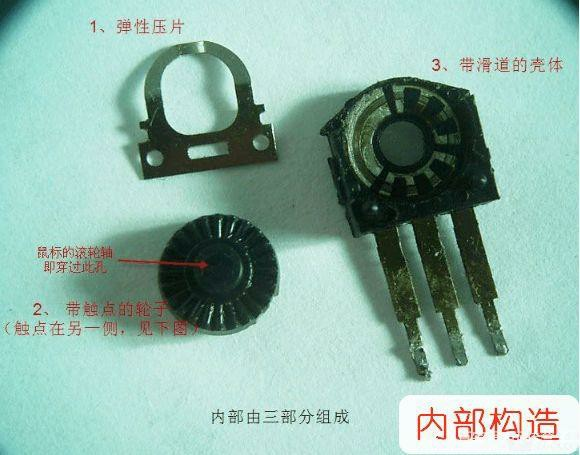

# 鼠标滚轮の手术

**前言**（一些碎碎念）

前些时候刚拆包的鼠标用了大概一个月，，她的滚轮就坏了。。可能因为是便宜鼠标吧。

但是她带灯光，用起来手感也不错，所以即使家里还有新鼠标也没有换（感觉太浪费了

你绝对想不到我这段时间是怎么过来的。因为在玩osu还是双鼠流（两个鼠标），所以就用另一个旧鼠标的滚轮来滚了...我也搞不懂我为甚么不直接用旧鼠标，可能这就是新鼠标的魅力吧。

前几天旧鼠标也不大灵了，这可火烧眉毛了。拉了半天滚动条看了看修鼠标的教程，下定决心给新鼠标做了手术（坚持不换是因为固执吧

结果意外得成功，至少现在还没有乱滚哪怕一格。

所以现在打算把所有旧鼠标都修一下。

## 拆壳

螺丝拧下来就行，有的可能不一样但也不多说了。

## 拿下电路板

轻轻拿下电路板，注意别把线拽断。

滚轮也活动活动就取下来了。

## 机械编码器

先简单说一下

架滚轮的地方一边是按键，另一边就是机械编码器

机械编码器在转动后，会在三个引脚上产生信号发送给芯片。滚轮不管用时很可能是机械编码器的触点接触不良，此时只需要把它拆开，将转子上的簧片角度拨大，转子与定子就能良好接触了。如果有时间还可以再用酒精擦擦。

好，现在要开始了。

用手钳或者小刀镊子，把机械编码器的小卡箍掰开

将定子拨开，取出转子（注意不要弄丢零件）

用针把转子上的簧片角度拨大，还很干净所以就不擦酒精了。

装回机械编码外壳，捏紧卡箍，装回电路板和鼠标外壳。赶快试一下，果然好了，太棒力。

以前用鼠标都是滚轮坏了，现在只要螺丝刀和手钳，感觉就能给鼠标无限续命，厂家看见了会哭吧。

