# 星舰首次轨道发射计划步骤

​	在德克萨斯州博卡奇卡的星际基地，33台Raptor发动机将点火，驱动超重型助推器产生约7600吨的推力，相当于1680万磅。这比土星五号火箭多出120%，比SLS火箭多出90%。它将首次进行组装完整的Starship飞船的轨道试飞任务。

​	这是一个完整组装的Starship火箭，位于美国得克萨斯州博卡奇卡的SpaceX太空发射设施中。

​	其中S24  Starship飞船高164英尺（约50米），直径29英尺（约9米），使用3个海平面版Raptor发动机和3个真空版Raptor发动机进行推进。

​	B7  SuperHeavy助推器高228英尺（约69.5米），直径29英尺（约9米），使用33个海平面版Raptor发动机进行推进。

​	整个火箭（即Starship和SuperHeavy助推器）被完全堆叠在一起，总高度为392英尺（约119.5米），并配备了39个Raptor发动机用于推进。

**倒计时开始（所有时间均为估计值）**

> 02:00:00
> SpaceX飞行主管开始询问各方是否准备就绪，并确认加油程序可以开始。
>
> 01:39:00
> 助推器开始加注液氧。
>
> 01:39:00
> 助推器开始加注液甲烷。
>
> 01:22:00
> Starship飞船开始加注液甲烷。
>
> 01:17:00
> Starship飞船开始加注液氧。
>
> 00:16:40
> Raptor发动机开始进行预冷处理，为点火做准备。
>
> 00:00:40
> 液体接口（用于连接推进剂）开始进行泄压处理。
>
> 00:00:08
> Raptor发动机启动序列开始运行
>
> 00:00:00
> 点火升空。

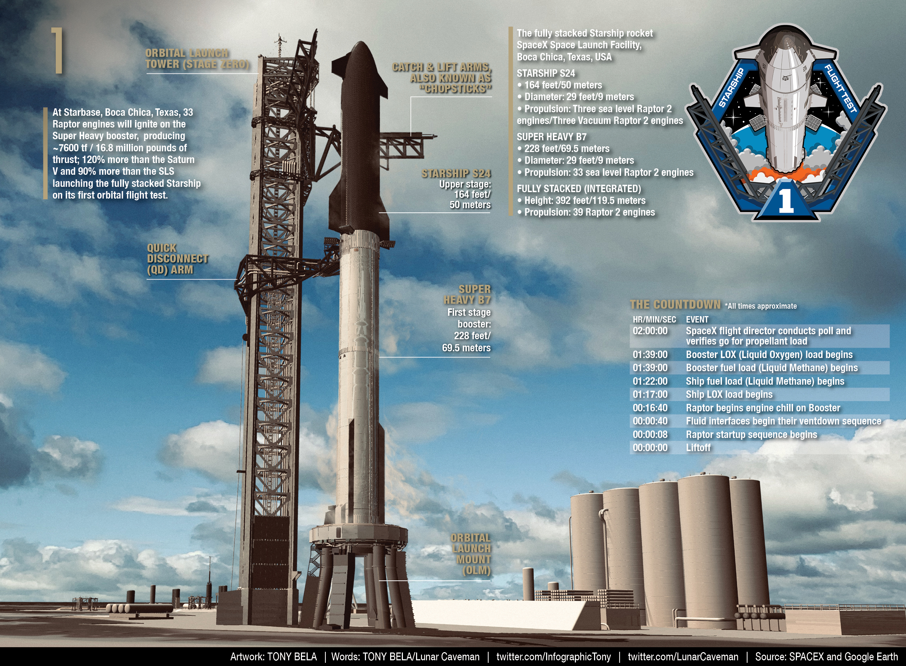

​	Max Q 最大空气动压点（火箭的最高机械压力时刻）：发射后约55秒。

> 这段话是关于飞行过程中的一个重要时间点，称为“最大Q值”或者“最大动力学应力点”。在火箭升空时，它会遇到空气阻力，从而导致机械应力的增加。这个最高应力点通常在飞行初期出现，通常发生在火箭离地上数十秒之后。在这一时刻，火箭承受的力量达到了最大值。在此以后，随着火箭进入更高的大气层，机械应力逐渐降低，火箭将进入轨道并展开任务。

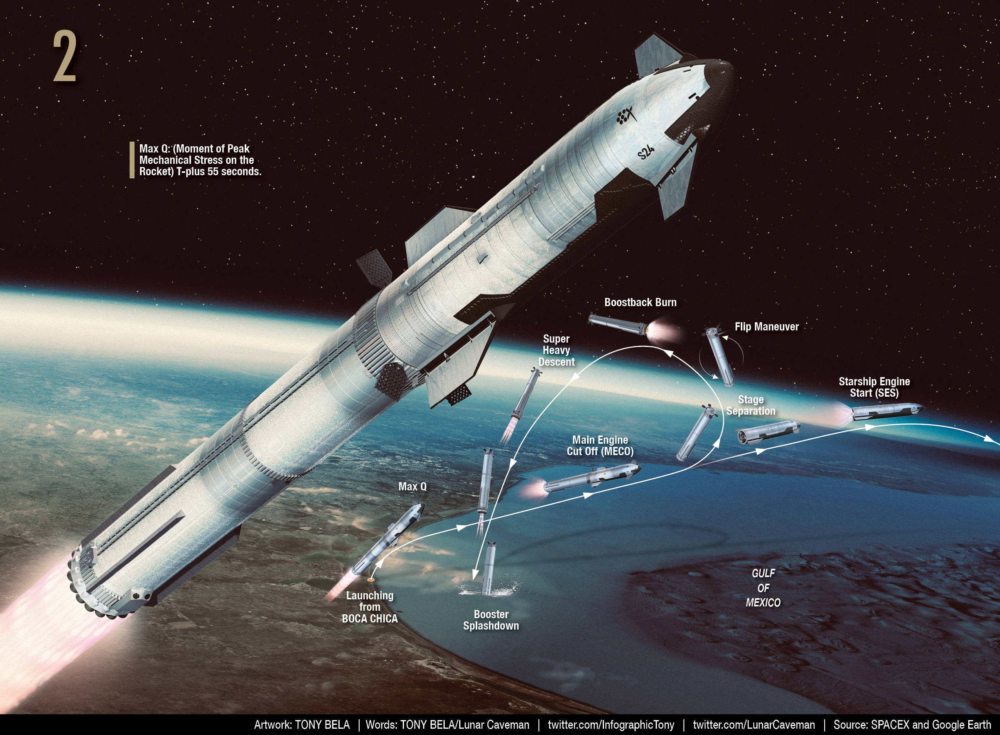

**33个Raptor 2发动机**
20个外侧发动机固定安装
13个内侧发动机可转动。

> 这段话描述了 B7 所使用的发动机配置。她总共搭载了33台全新的Raptor 2液氧/甲烷发动机。在这些发动机中，有20个发动机是被固定安装在整个系统的外侧，而另外13个发动机则是可以转动的，用于控制火箭的姿态和方向。这个复杂而高级的发动机配置设计旨在为Starship和SuperHeavy提供足够的推力和灵活性，在遥远的空间环境中实现太空探索任务。

​	主发动机熄火（MECO）：发射后约2分49秒。

> 这段话描述了一个重要的飞行时刻，称为“主发动机熄火”（MECO）。在某些火箭飞行任务中，主发动机需要一段时间内不断地将火箭推向大气层之外。当火箭进入预定轨道或完成任务后，主发动机会自动关闭。在此时刻， B7 的主发动机将在发射后约2分49秒时自动关闭。这标志着她已经完成了最重要的推进和加速工作。

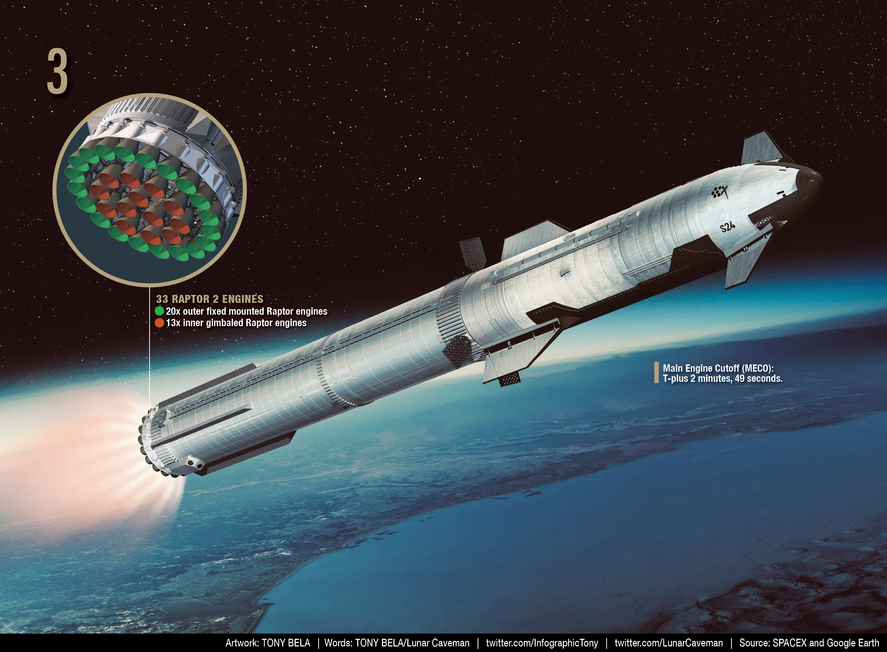

​	分离阶段：发射后约2分52秒。

> 这段话描述了火箭飞行中的另一个重要时间点，称为“分离阶段”。在S24和B7的飞行过程中，两级需要在适当的时候进行分离。在这个时刻，两个阶段将会进行分离，使得Starship飞船可以进一步升空并执行任务，而SuperHeavy助推器则会回收或坠落。这个过程需要非常精确的计算和控制，并且必须在特定时刻完成。根据最新的计划，分离阶段将在发射之后大约2分52秒时进行。

​	在Super Heavy火箭MECO之前，将使用类似于SpaceX Starlink卫星部署的过程。此时，超级重型火箭会利用其内部万向节猛禽发动机开始旋转。然后，其保持夹具将被释放，使得火箭的两个部分漂移分离。

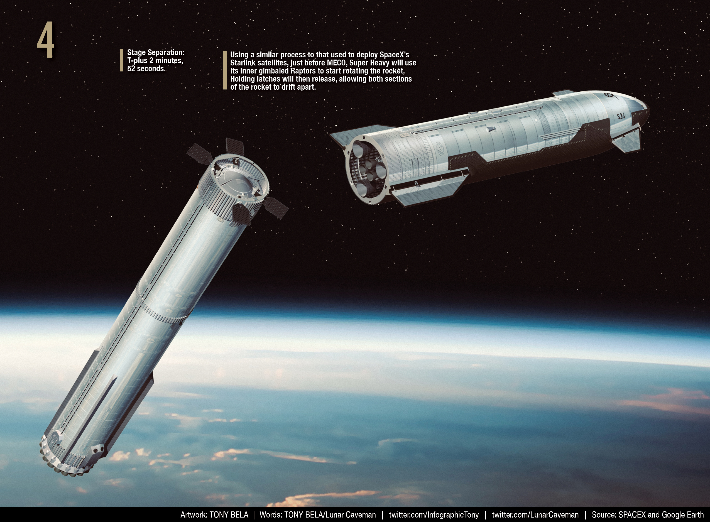

BOOSTBACK BURN（返场点火）

​	当Super  Heavy火箭被旋转成垂直状态时，所有13个万向节喷气推进器将重新点火，将B7推进到高弧线状态，峰值高度超过100公里，并加速返回Boca  Chica。

​	返场点火启动时间为T+3分钟11秒

​	返场点火关闭时间为T+4分钟6秒。

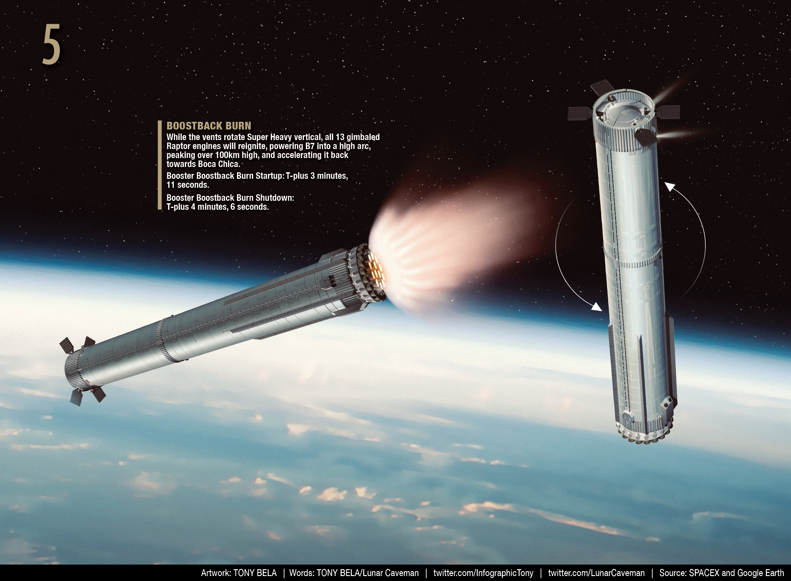

​	在返场点火后，喷口会再次将Super Heavy旋转。

​	当Super Heavy降落回地球时，网格翼片将引导着它，以最佳滑翔姿态返回目标降落点。

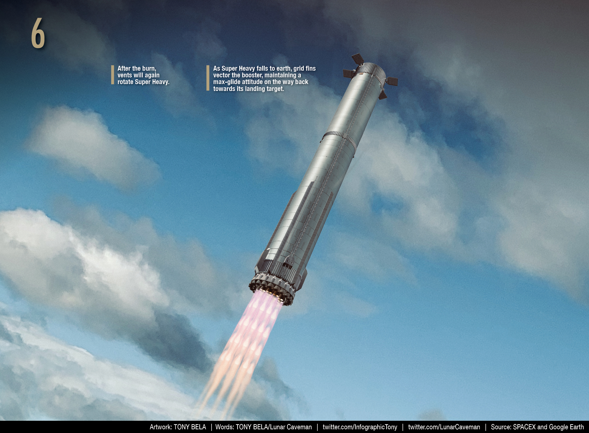

​	中心的猛禽发动机将点火，以减少助推器的速度并稳定地降落。
​	助推器着陆点火启动时间为T+7分钟40秒，
​	助推器着陆点火关闭时间为T+8分钟3秒。

​	与猎鹰9号的降落方式类似，助推器的初始着陆目标是水中的安全区域。一旦降落发动机点火并验证了正控制，B7将悬停后在墨西哥湾溅落。这些数据将被收集和分析，以帮助未来计划在位于Boca Chica的Starbase轨道发射塔上进行的捕获工作。

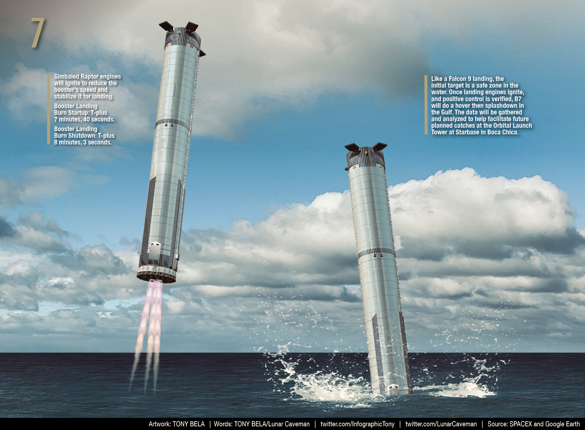

​	Starship点火时间为T+2分钟57秒。

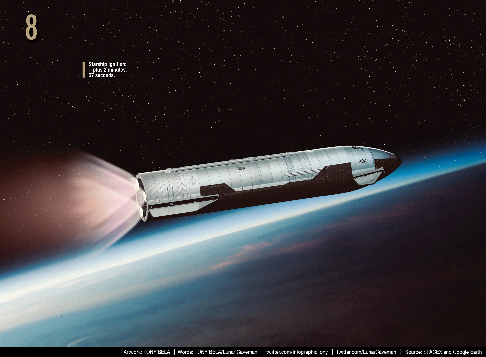

​	Starship引擎关闭时间为T+9分钟20秒。Starship将环绕地球大部分路程，并计划在太平洋中靠近夏威夷群岛处溅落。

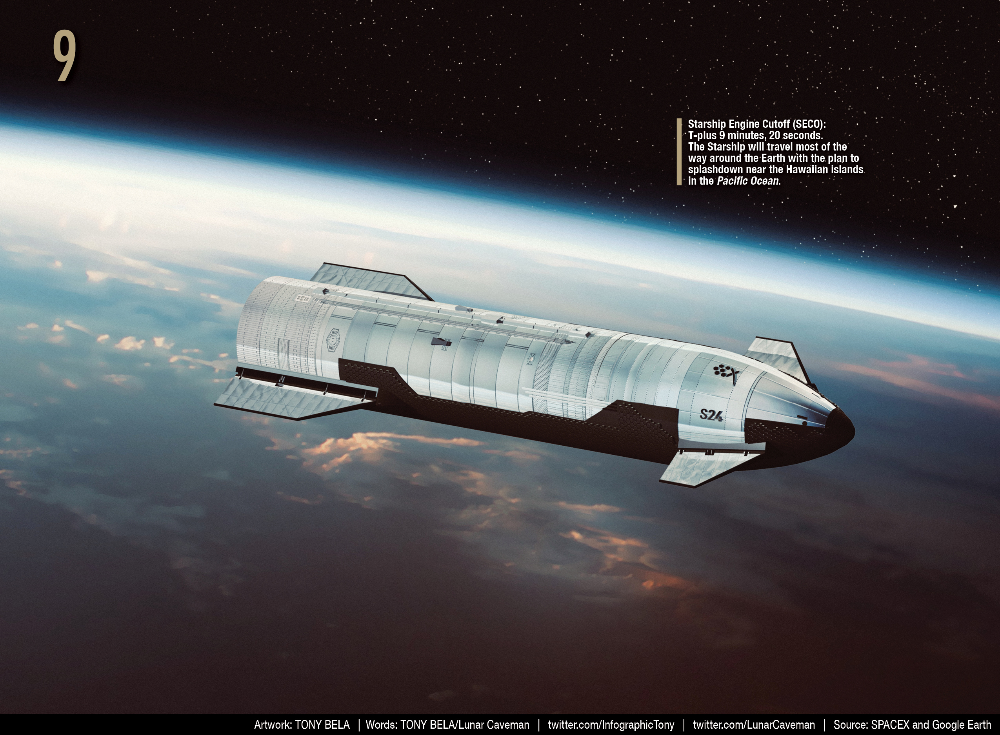

​	大约在发射后77分21秒，Starship将重新进入地球的大气层。 （一个完整的轨道周期大约是90分钟）。

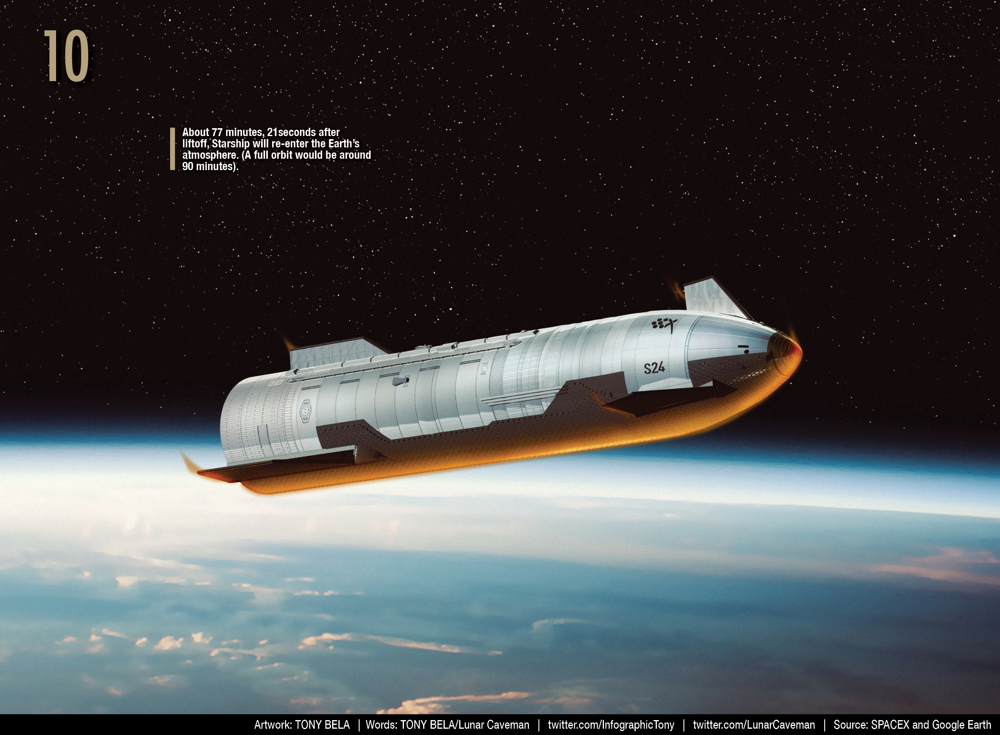

​	安装在Starship的腹部和襟翼上的热防护瓦片将减少再入阶段中达到的巨大温度。

​	当Starship进入大气层时，它前方将形成一个冲击波并通过空气分子的压缩引起离子化，从而创造出一个等离子层。

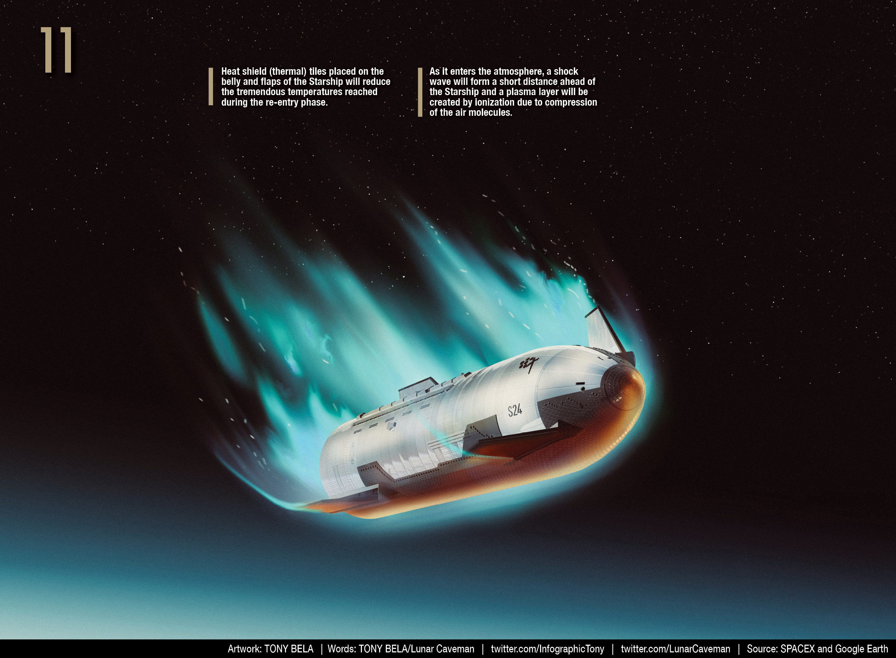

​	接着，Starship将通过前后襟翼控制，在整个自由落体过程中直接下落到海洋表面。截至发布时间，SpaceX已经表示他们将不会尝试“翻转再点火”这种机动操作。

可操纵的襟翼

> ​	在起飞时，前后襟翼是固定的。但在再入和降落过程中，需要通过控制襟翼的位置（俯仰、偏航和横滚）来控制Starship的姿态。因此需要使用活动式的前后襟翼。

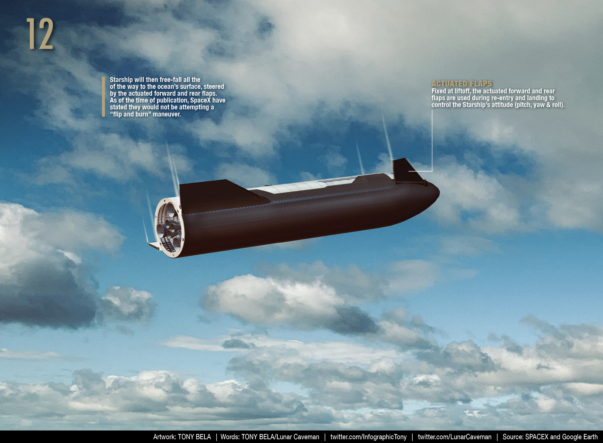

​	假设Ship24成功经历再入大气层，它将一直保持水平控制状态，直到落水。

> 这句话的意思是，如果S24成功地从太空返回地球，它将保持稳定的水平姿态，直到最终落入水中。这种控制状态可以确保船只在下降过程中不会失去控制。

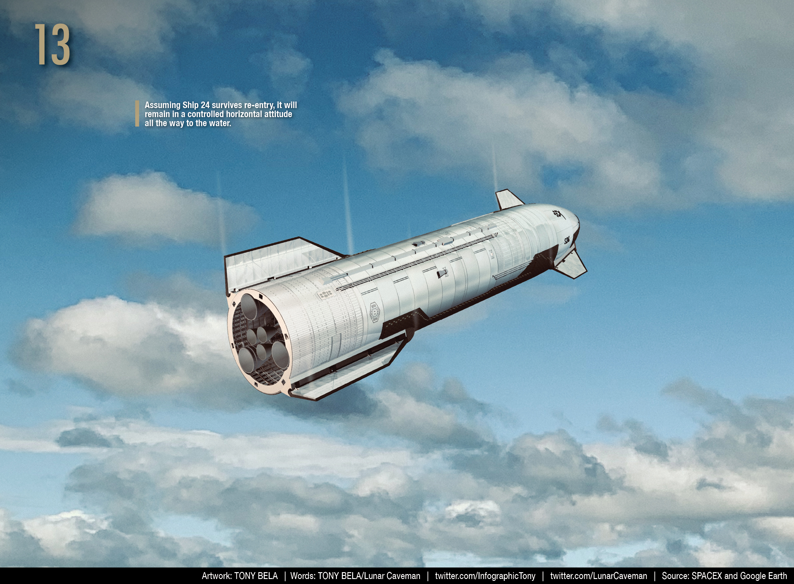

​	星舰S24将在发射后约90分钟内落入水中，位置位于夏威夷卡乌艾岛西北方约62英里/100公里处。

​	埃隆·马斯克曾说：“我们的目标是实现进入轨道而不爆炸。”

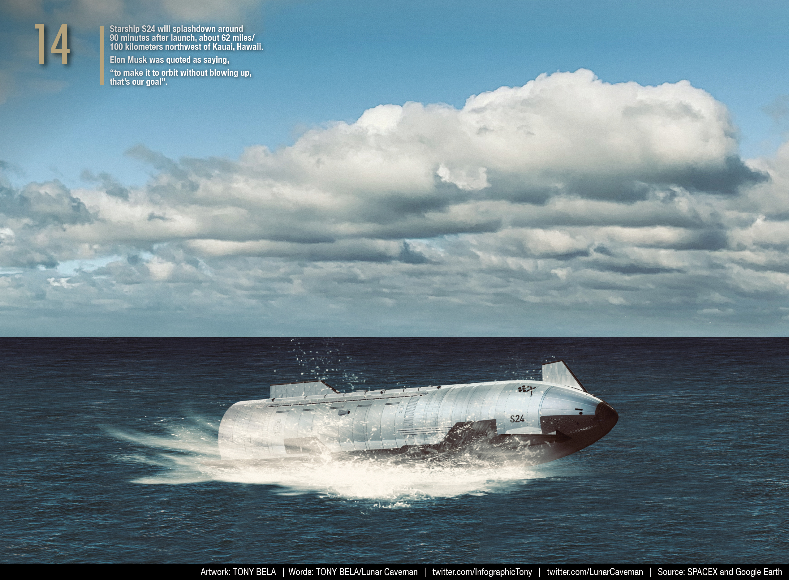