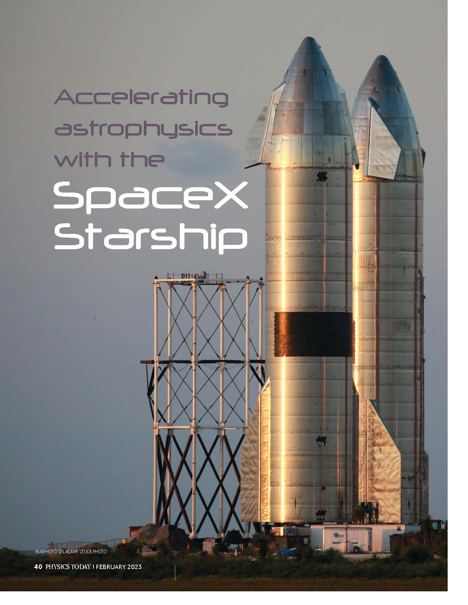
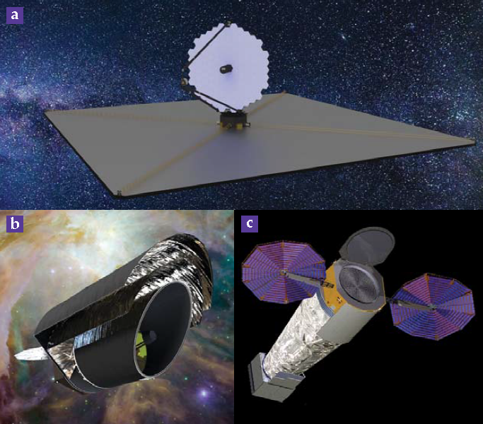
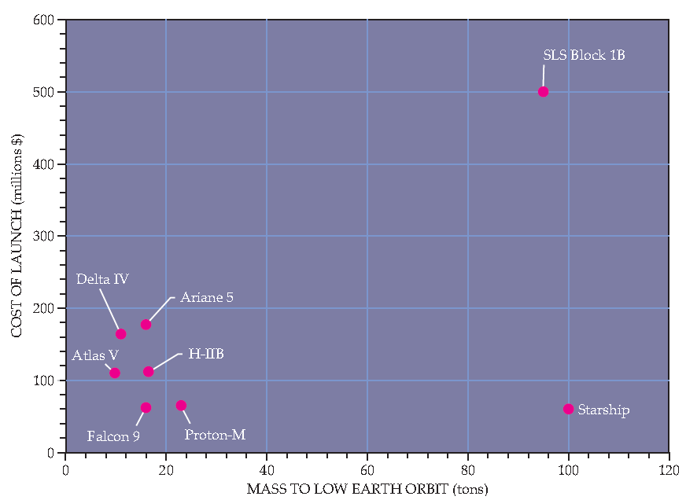
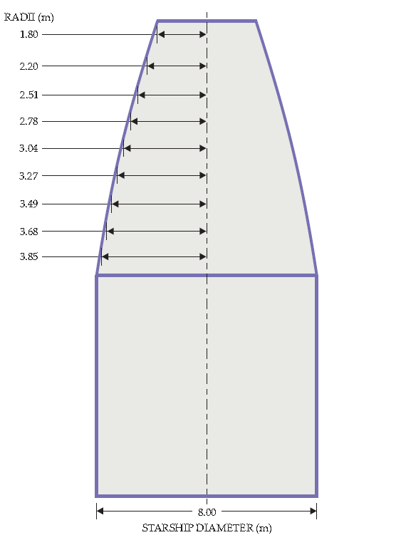

# 用SpaceX Starship加速天体物理学研究进程

> Martin Elvis是马萨诸塞州剑桥市天体物理学中心哈佛-史密森尼研究所的高级天体物理学家。Charles  Lawrence是加利福尼亚州La Cañada的NASA喷气推进实验室天文和物理学的首席科学家。Sara  Seager是马萨诸塞州剑桥市麻省理工学院的物理学教授。

> Martin Elvis, Charles Lawrence, and Sara Seager：
> 通过显著增加其可重复使用的运输系统的质量和容积而不增加成本，SpaceX可以使NASA提前数年实现未来的任务。

---

​	从2019年到2021年，美国天文学界进行了一项规划练习，为未来十年及以后的任务做出准备。这项努力的成果是《天文学和天体物理学的发现之路：2020年代的路径》十年计划调查报告。通常称为Astro2020，它设想了一组雄心勃勃的新“大型望远镜”，作为社区的首要任务。（每个作者都与Astro2020认可的一个观测站密切相关。）这些新的大型望远镜中有一些在图1中显示，它们将收集跨越电磁波谱的测量数据，从远红外到X射线，能力比著名的前任（如斯皮策空间望远镜、哈勃太空望远镜、康普顿伽玛射线天文台和钱德拉X射线天文台）提高了数倍。

​	为了控制NASA的天体物理学预算，他们的发射日期已经推迟到2040年和2050年，这是一个艰巨的时间表。即使第一个观测站发射，今天新获得博士学位的人也只有十年左右的工作时间。不幸的是，这意味着在2030年代，所有波长的旗舰能力可能会出现十年左右的空白期，这对科学和NASA的技术领导地位都是不利的。

​	Astro2020是在静止的太空能力背景下进行的。然而，从2020年底开始，SpaceX一直在开发一种大型、完全可重复使用的发射系统，称为Starship，包括Starship上级和超级重型助推器。超级重型还没有飞行过，尽管Starship经历了戏剧性的进展，从早期测试中多次爆炸，被戏称为“快速非计划性解体”，到2021年中期成功进行了高空测试飞行和软着陆。NASA委托的最大旗舰任务研究需要三年时间，在2019年完成。不幸的是，这个时机不对，导致Starship的能力只能在Astro2020讨论中被简要考虑。

​	假设它成功了，Starship将以质的飞跃的方式显著提高我们的太空能力。Origins、Worlds和Life报告中讨论了我们太阳系行星科学任务的能力，并强调Starship可以加速NASA的行星计划。本文将讨论天体物理学的类似机会。

## 质量、尺寸和成本。

​	天体物理学任务一直受制于发射器的能力限制，而这些能力在过去20年中没有实质性的改变。星际飞船将带来三个变化：更大的轨道质量、更宽的货舱和可能降低发射成本。

​	多年来，运载到低地球轨道的最大质量约为10-25公吨。而星际飞船用户指南显示，该飞行器能够将大约100公吨物品运送到近地轨道，是其他发射器的4-10倍。星际飞船将能够将21公吨物品送入地球静止轨道，并将约18公吨物品送入日地L2拉格朗日点轨道，这是许多天体物理学任务的首选轨道，包括詹姆斯·韦伯太空望远镜（JWST）。NASA的月球星际飞船人类登陆系统需要在轨加注燃料。星际飞船可以将重达100吨的观测站运往月球、L2轨道或几乎太阳系中的任何地方。

​	太空观测站从它们各自的发射器的上层舱，也就是有效载荷护罩中部署。然后它们独立地进行运行，通常可以运行数年甚至几十年。本世纪发射的所有重型运载工具的内部护罩直径都在4-5米之间。Starship将把这个直径加倍到8米，并略微增加典型的有效载荷高度，如图3所示。

​	大多数运载器的设计和建造成本超过1亿美元。少有例外的是Proton-M和Falcon 9运载器，它们的成本约为6000万美元，但Proton-M车辆的生产已于2022年终止。Starship的目标是比Falcon 9火箭更便宜。但即使运载器的成本为零，如果没有Starship所设计的大幅增加有效载荷质量和体积，它也不会带来革命性变化。例如，针对NASA的中型探测任务的6000万美元的发射成本占了该任务3000万美元预算的20%。

> 图1. NASA正在计划开发新的伟大天文观测站。这里展示了早期的设计概念：(a) LUVOIR天文观测站，(b) 起源空间望远镜，(c)  以及Lynx  X射线观测站。无论最终仪器采用什么形式，它们都将被送入太空收集电磁波谱上的测量数据，回答天文学和空间科学中最重要的未解之谜。SpaceX公司的Starship运载火箭可能会在本世纪中叶之前将这些天文观测站送入太空。（图片由NASA/GSFC提供）

## 任务设计革命

​	传统上，太空任务设计中的重量和体积是主要考虑因素，但星际飞船则将重量降至次要设计因素。这种方法将简化决策，减少必须完成的设计周期数，以达到可行的解决方案。传统上，为了节省重量，航天器通常需要严格的性能保证。但是，由于对重量要求较宽松，任务设计可以使用更简单、更重的部件和不太复杂的材料，同时结合更稳健的工程保护系数。

​	据《起源、世界和生命》报告称，星际飞船可以容纳比传统 NASA 行星负载大得多且更重的货物，从而显着减少传统 NASA 负载所需的大小和重量成本。星际飞船可以在一次飞行中运送多个负载和仪器，从而减少总体风险，并且可用于提供更多的负载电力。

​	简言之，星际飞船的出现将改变传统航天任务设计中的思考方式，让我们能够更加高效地进行太空探索并尝试更多新颖的技术实现。

​	在NASA的SPHEREx（宇宙历史、重离子化纪元和冰探测光度计）这个中等规模的项目的设计阶段，工程师们利用了SpaceX Falcon 9运载火箭的可用质量来帮助解决问题并降低成本。NASA喷气推进实验室的SPHEREx项目经理艾伦·法林顿告诉我们：“SPHEREx从提案到关键设计审查一直采用将风险转化为质量的方法。一个关键示例是太阳-地球罩，我们将技术难度较大、最先进的软质材料技术替换为更庞大但更先进的铝蜂窝板。这使得风险更低，并且得益于我们Falcon 9运载火箭的多余质量能力。”

​	JWST是因紧密的尺寸和质量约束而面临的困难的典型例子。阿丽亚娜5号运载火箭将总有效载荷质量限制在6.2吨。JWST主镜片及其支撑结构占据了总任务质量的1/6。这与哈勃望远镜的镜片相似，但面积几乎是其6倍。为了JWST的需求，哈勃式望远镜的质量将达到近5吨，即可用有效载荷总重量的3/4。

​	发射器能力的限制迫使项目科学家开发创新的、轻量级的、高承载-质量比的技术。使用铍作为镜片材料部分是由于JWST的操作温度在20-55 K时需要高导热性以最小化热梯度。需要展开一个大型而薄的太阳遮板也带来了其他后果，包括降低了亚秒级的转动速率和延长密封时间，两者都减少了每天可以完成的科学工作量。

​	即使JWST成功部署并证明了技术方法的正确性，设计的复杂性仍然需要大量的规划和测试，增加了成本并延长了项目的进度。利用Starship的大型舱口直径和体积，6.5米的JWST主镜片可以制成一个质量每平方米类似于哈勃的单个组件。5吨的JWST仍然只占运送到太阳-地球L2轨道的总质量的10％，因此不是主要的设计考虑因素。单一的镜子避免了排列18个六边形镜子的复杂性。虽然Starship也不能避免所有这样的折纸机构展开，但JWST太阳遮蔽板仍然比Starship计划中的舱口尺寸大。

​	尽管雄心勃勃，但将总任务成本降低一半是成本节约的关键阈值。同样的预算随后可以资助两倍于现有任务数量的任务，这对于可能让2040年代计划的任务提前到2030年代的新“伟大天文观测”项目来说，将会是一个变革。当一组伟大的观测站正在同时运行时，发现的速度会加速，因为一个观测站的发现通常会导致其他观测站的新调查。

> 图2.  历史上，航天任务一直受到发射载具和它们能够带到轨道上的有限质量的约束。SpaceX公司开发的即将推出的Starship运载工具可能通过以更低的成本将更多的质量运送到地球低轨道上，从而提供新的机会，相较于竞争对手而言。（图表由Freddie Pagani绘制，数据来自以下来源：Ariane 5，Arianespace；Proton-M，International Launch  Services；Atlas V和Delta IV，United Launch Alliance；H-IIB，JAXA；SLS Block  1B，NASA；Falcon 9和Starship，SpaceX。

## 所有频段的增益

​	现在，天文学观测覆盖了电磁波谱中超过10个数量级的频率范围，从无线电波段的108 Hz到X射线的超过1018 Hz。利用Starship运载火箭的能力来获益的方式取决于频段。Astro2020的白皮书提出的任务可以作为指南。这些任务涵盖了几乎所有频段的电磁波谱，以及宇宙射线和中微子等替代信使。

​	对于传统的厘米波段无线电领域，显而易见的下一步是将非常长基线干涉术扩展到比地球直径更长的基线。这将使研究人员获得更高的角分辨率、更快速和更密集的UV平面覆盖，可实现相应的高动态范围成像。俄罗斯Spektr-R和日本Haruka任务，具有1-2吨的适度有效负载，证明了技术可行性并存在可供研究的无线电源。由于两个任务的直径大小只有8-10米，以及它们只有单个地球到太空的基线，因此两个任务的结果受到限制。

​	Starship火箭可以使用类似打开伞的机制，在一次发射中部署多个直径长达30米的天线。这些天线的毫米波宽容度将允许探测各种天体物体。从多个天线中获得UV平面覆盖增益随基线数量NBASELINES的增加而迅速增加，与天线数n成二次关系：NBASELINES = n（n-1）/2. 虽然Starship的发射成本不重要，但同时发射整个阵列可以缩短项目建设时间并节省成本。

​	在频率低于30 MHz和波长大于10米的无线电领域进行射电天文观测，可以利用中性氢宇宙学签名来访问“暗时代”，即第一颗恒星形成之前的时期。由于电离层阻挡和高人类创造的无线电背景，这种方法在地球上是不可行的。月球背面可能是我们太阳系中唯一一个可以探测到该宇宙学信号的位置，因为月球提供了90 dB的地球干扰抑制。然而，银河系自行辐射可能会被证明是不可逾越的噪声来源。Starship可以将100吨货物运送到月球上的任何地点，因此可以运输望远镜，并且如果必要的话，机组人员可以重新配置它。

​	最近毫米到亚毫米波段中最著名的结果可能是2019年在星云M87的超大质量黑洞阴影图像，它来自基于极长基线干涉的事件视界望远镜。该图像曾在全球引起轰动，2022年在银河系的Sagittarius A*的图像也同样受到关注。理论预测图像中有精细结构，但无法用地球上可接触到的10000公里基线和有限频率覆盖范围来证实。

​	利用高轨道可以实现更长的基线，尽管需要多个天线才能提供足够的UV平面覆盖。更高的角分辨率可以揭示加速喷流接近光速时的物理原理，并且可以将可观测到的黑洞阴影数量从两个增加到至少数十个。

​	利用在地球同步轨道上的卫星或月球上的望远镜可以实现超过30万公里的真正长基线，即使只有一个基线，也可以清晰分离广义相对论效应和天体物理效应。光学激光通信技术现在已经达到了在低地球轨道上传输数据的高速率，很快就应该开始在更长基线的望远镜上进行演示。

​	亚毫米波段的天线必须设计到几十微米的容差，这个约束条件使得部署光学系统不那么吸引人，但增加质量变得更加吸引人。Starship可以在一次发射中将多个6米级别的单块天线叠加到地球同步轨道上，以降低成本并加快进度。另一艘Starship可以将亚毫米波望远镜放置在月球上的任何位置。

​	在远红外光谱区域，NASA研究过一种旗舰概念——Origins Space Telescope。它被设想为一个直径为5.9米的主镜，并冷却到只有4.5K，以在整个25-588微米波段上具有低热背景噪声。Origins将比其前任任务Herschel Space Observatory和Spitzer拥有更高的灵敏度和光谱分辨率。Origins的早期设计已经计划利用以下三种方案之一：Starship的较大直径罩壳（当时称为Big Falcon火箭），NASA的Space Launch System（SLS）或Blue Origin计划中的New Glenn发射器。

​	Origins概念研究没有充分利用Starship和SLS的质量能力。Origins的重量仅有13吨，即使包括所有备用和储备物资。与所有远红外天文台一样，Origins需要类似于太阳-地球L2点的轨道：这种轨道足够远离地球，以避免其热对数据采集造成干扰。即使是对于一个没有加注燃料的Starship，Origins也可以承载四倍的质量。这个决定可以带来节省成本的机会，例如简化主镜材料的选择。

​	为了支持近红外、光学和紫外线天文学，NASA在Astro2020调查中构想了适于居住的系外行星观测望远镜（HabEx）和LUVOIR任务。这些项目考虑了从2.4米到15米可能的镜片直径范围。每个概念任务最严格的科学目标是直接成像系外地球——绕它们旋转的恒星的适居带内类似地球的行星，然后测量它们大气层的光谱，以寻找生物标记或其他生命迹象。然而，这些恒星比围绕它们的系外地球明亮得多，因此需要一个严格的对比度比10-10。为了平衡成本和可访问预计数量的系外地球之间的关系，Astro2020建议一项未命名任务，该任务将使用一个6米的主镜片，这是HabEx和LUVOIR之间的折中方案。该未命名任务的预计发射日期是2045年，主要原因是其110亿美元的成本估算。

​	Starship可以将6米的主镜片搭载到轨道上，而且它可以具有类似于哈勃望远镜的单位面积质量甚至更高的质量，而不会对设计带来问题。由Starship带来的更大可用质量为Astro2020预计的新任务提供了新颖的设计可能性。天文学家和工程师需要探索各种设计，以确定是否可以以更低的成本建造这样的任务。

​	对于X射线观测，NASA在Astro2020准备阶段研究了Lynx X射线旗舰概念，其成像和高分辨率光谱能力比Chandra的直径为1.2米的镜片强大数百倍。Lynx的X射线镜片直径为3米，具有亚角秒级的角分辨率，并采用浅角度反射X射线的斜入射光学技术。镜组占据Lynx总重量的25％，预计总重为7.7吨，其中2吨用于镜片组件。

​	为了避免镜片质量超过Starship可用的有效载荷，Lynx科学家选择了0.5毫米薄的镜片段作为斜入射光学系统的材料。而Starship则可以使用更厚的2毫米镜片段制作X射线镜片。由于刚度与厚度的立方成正比，这些更厚的镜片段将比薄的镜片段刚度高60倍。

​	这样，Lynx任务所需的亚角秒级的图像质量就更容易实现。可以采用更简单的固定和对准系统，这样更易于组装，可能会导致成本节省。像其他任务一样，释放质量约束可能会导致更低成本的有效载荷和航天器。由此产生的8吨镜片组件可以轻松容纳在Starship上。

​	除了新的伟大观测台之外，还有许多更为谦虚的仪器的创新想法。例如，极端多信使天体物理探测器（POEMMA）任务将使用一对从轨道指向下方的4米施密特望远镜，利用荧光和Cherenkov闪烁来成像广泛的空气阵列（EASs）。超高能宇宙射线和中微子在地球大气层中产生EASs。当POEMMA指向地心时，它成像这些宇宙射线，当它指向边缘时，它成像上行的EASs中的中微子。从轨道上所探测到的大气体积给予POEMMA比现代望远镜高10到100倍的性能提升。

​	Starship的低成本将允许单独发射两个POEMMA望远镜，并且发射车辆的大容量将消除部署机制的需求。利用宽阔的Starship舱口发射更大的6-7米望远镜可能会获得高达三倍的收集面积提升，但是制造必要的6米施密特校正镜头的成本可能会排除该选项。

​	POEMMA只是Astro2020提交的许多探测器级别任务概念之一。Astro2020估计探测器的成本约为15亿美元，这意味着NASA天体物理学预算每十年只能支付一个探测器的成本。Starship可以使探测器更便宜，以便开发更多和更不寻常的探测器，例如POEMMA。

> 图3. SpaceX的Starship将通过提供两倍宽的有效载荷舱口重新定义发射能力，这将允许更大的、不那么复杂的仪器被带到太空中。Starship的发射车长度为17.24米，比行业通常的15-16米的发射车更为宽敞。（由SpaceX提供。）

## 更便宜、更快，但要注意更好。

​	太空科学界可以利用Starship潜在的成本节省优势来加速Astro2020计划，但这种方法需要所有参与者的纪律性。 “更快、更好、更便宜”是NASA局长丹尼尔·戈尔丁（Daniel Goldin）在1992年至2001年间的口头禅，但它导致的结果最多只能做到半成功。Starship似乎有望提供更快和更便宜的发射车。然而，提出任务建议的团队总是希望将所有可用的质量预算投入到更大的镜片和更多的仪器中。这种思路在许多情况下会导致庞大而复杂的设计，随着质量的增加而带来昂贵的成本。追求“更好”可能会危及更快和更便宜的目标，因此太空科学界需要发展出约束科学家胃口的最佳实践。

​	太空机构需要监测并避免任务扩张，但这并不容易。行业和机构模型通常会根据质量来预测任务成本。Starship可以引领一种新的范式，即增加质量将降低成本。但这不是一个容易的过程。由于没有记录表明使用质量和体积来降低成本的方法是否成功，因此这种方法最初可能带来更高的风险。

## Starship 注意事项

​	Starship可能无法达到期望。它可能会运行，但成本会更高，承载能力会降低，或者在轨加注燃料可能无法实现。SpaceX提供的Starship发射成本可能只是其自身的估算，并不包括客户价格，所以客户需要支付更高的费用。实现明显降低的发射成本取决于每个Starship的快速、频繁重复使用，但市场上可能没有足够的需求。对Starship所承诺的预期节约的仔细检查也有可能被证明是虚幻的。

​	然而，几乎所有新技术的发展都面临类似的风险。因此，这些风险并不足以成为否认Starship技术成功可能会对天体物理学产生的最大影响的充分理由。

​	NASA开发的SLS在质量到达近地轨道和有效载荷体积方面与Starship具有可比性。因此，它为Starship提供了一些后备支持。然而，一个SLS发射的成本估计为8亿美元至27亿美元，这将是任何价值甚至5亿美元的大型天文观测任务中的一个主要因素。除非政治上命令，否则具有如此规模的发射成本可能会使这样的天体物理学任务无法竞争。SLS是完全一次性的，因此更多的发射车生产率是一个关键考虑因素。波音公司作为SLS的主要承包商，其生产率最多每年只能生产两个SLS。NASA的“Artemis”人类太空飞行计划预计将在接下来的几年内占用大部分SLS发射位。那么在未来十年左右的三次发射是否可用于新的大型观测任务？

​	即使Starship能够如广告所述工作，额外的质量也不是没有缺点。更多的质量增加了航天器的惯性矩，并需要更大的反作用轮来指向目标。此外，在流行的太阳-地球L2环绕轨道上保持位置要求比例更多的推进剂，或者由于额外的质量而限制任务寿命。

​	Starship很可能在未来五年内证明成功与否。这给NASA足够的时间来准备迎接Astro2020中期评估时代的新发射能力。在接下来的几年里进行一系列协调的研究，以详细探讨Starship如何实现、加速和扩展Astro2020计划，将使NASA的天体物理学计划在Starship成功时能够立即行动。但即使Starship失败，为其成功做规划所失去的努力与天文学所获得的潜在收益相比，是微不足道的。

​	作者感谢Lee Armus、Jack Burns、Allen Farrington、Tom Megeath、Joe Silk和Alexey Vikhlinin的宝贵交谈。本文中包含的成本信息仅供预算和计划用途，仅供信息参考，不构成喷气推进实验室和加州理工学院的承诺。

> 参考文献：
> 1. 美国国家科学工程和医学院，《Pathways to Discovery in Astronomy and Astrophysics for the 2020s》，国家科学出版社（2021年）。
> 2. 美国国家科学工程和医学院，《Origins, Worlds, and Life: A Decadal Strategy for Planetary Science and Astrobiology 2023-2032》，国家科学出版社（2022年）。
> 3. T. Burghardt，“NASA在选择SpaceX的Starsh ip进行首次Artemis登陆后，正在寻求未来航天器”，NASASpaceflight.com，2021年4月20日。
> 4. A. Mann，“SpaceX现在主导火箭飞行，为NASA带来巨大的好处-和风险”，Science，2020年5月20日。
> 5. H. Warren，“詹姆斯·韦伯太空望远镜的镜子：回顾过去”，NASASpaceflight.com，2021年11月13日。
> 6. K. Q. Ha，M. D. Femiano，G. E. Mosier，“Proceedings of SPIE，Volume 5528: Space Systems Engineering and Optical Alignment Mechanisms”，L. D. Peterson，R. C. Guyer 编辑，SPIE（2004），doi:10.1117/12.558456。
> 7. Y. Y. Kovalev等人，“XXXIth URSI General Assembly and Scientific Symposium”，IEEE（2014），doi:10.1109/URSIGASS.2014.6929994；H. Hirabayashi等人，AIP Conf. Proc.，599，646 (2001)。
> 8. J. D. Bowman等人，“Nature 555, 67 (2018)；J. Silk，Found. Phys. 48，1305 (2018)。
> 9. J. O. Burns等人，“Planet. Sci. J. 2, 44 (2021)。
> 10. D. W. Pesce等人，“Astrophys. J. 923, 260 (2021)。
> 11. M. D. Johnson等人，“Sci. Adv. 6, eaaz1310 (2020)。
> 12. M. Meixner等人，h􀄴 ps://arxiv.org/abs/1912.06213。
> 13. S. Gaudi等人，“Bull. Am. Astron. Soc. 51(7) (2019)，paper no. 89；LUVOIR team，h􀄴 ps://arxiv.org/abs/1912.06219。
> 14. A. Vikhlinin，“Bull. Am. Astron. Soc. 51(7) (2019)，paper no. 30.
> 15. A. V. Olinto等人，“Bull. Am. Astron. Soc. 51(7) (2019)，paper no. 99。
> 16. H. E. McCurdy，《Faster, Better, Cheaper: Low-Cost Innovation in the U.S. Space Program》，约翰霍普金斯大学出版社（2001年）。
> 17. E. Berger，“最终，我们了解了SLS和Orion的生产成本，它们是很高的”，Ars Technica，2022年3月1日。
> 18. J. Foust，“NASA和波音展望长期的SLS生产计划”，SpaceNews，2019年12月11日。
>

原文下载：https://physicstoday.scitation.org/doi/10.1063/PT.3.5176

